# Base des dépenses et restes à charge pour les établissements de santé publics

## Périmètre de la base

### Champ 

Le champ de la base RAC est détaillé dans la [présentation générale](../documentation/presentation_generale.md) de cette base.

### Les dépenses en établissements de santé (ES) dans la base RAC

Pour le public, les dépenses associées aux séjours hospitaliers (y compris les dépenses en sus) et aux actes et 
consultations externes (ACE) sont issues du PMSI, tandis que les dépenses liées à 
l'activité libérale des praticiens hospitaliers sont issues du DCIRS.  
Les dépenses à l'hôpital public sont regroupées au sein du poste *etab_public*. 

Pour le privé, les dépenses sont issues du DCIRS. Elles sont regroupées au sein du poste *etab_priv*.

Le « public » recouvre plus précisément les établissements ex-DG (établissements publics et ESPIC ex-DG), tandis que le « privé » recouvre les établissements privés à but lucratif et non lucratif (hors ESPIC ex-DG).  

Par la suite, nous décrirons uniquement comment extraire les dépenses et RAC AMO en établissements 
de santé publics à partir du PMSI.  
L'extraction des dépenses et RAC AMO en ES privés, à partir du DCIRS, est traitée avec les soins de ville.  
Idem pour l'activité libérale à l'hôpital public.  
Pour plus d'informations, [se référer à la documentation et aux codes de la base RAC, partie soins de ville et ES privés](../documentation/base_RaC_soins_de_ville.md). 

## Règles de calcul : dépenses et RAC en ES public

### Règles générales 

La méthodologie d'extraction des dépenses et RAC par PMSI (tables et variables à utiliser, filtres à appliquer, variables à nettoyer, modalités de calcul) est décrite en détail dans les fiches thématiques suivantes :

- [Dépenses des établissements de santé publics dans le PMSI](https://documentation-snds.health-data-hub.fr/fiches/depenses_hopital_public.html) (séjours et ACE)
- [Médicaments de la liste en sus](https://documentation-snds.health-data-hub.fr/fiches/medicaments_de_la_liste_en_sus.html)
- [Dispositifs médicaux implantables en sus du GHS](https://documentation-snds.health-data-hub.fr/fiches/dispositifs_medicaux_implantables_en_sus.html)
- [Reste à charge après AMO en établissements de santé publics](https://documentation-snds.health-data-hub.fr/fiches/rac_hopital_public.html)

*Note :* Les dépenses associées aux séjours ou ACE comprennent une part standard,  calculée sur la base des tarifs nationaux de prestations, ainsi que d'éventuelles dépenses en sus (médicaments ou dispositifs médicaux implantables de la liste en sus).

### Spécificité de la base RAC partie hôpital public

Nous ne traitons ici que les dépenses et restes-à-charges après Assurance maladie obligatorie (AMO) extraits du PMSI.  
Nous ne calculons donc que la partie opposable du reste-à-charge (*i.e.* hors dépassements, qui sont extraits du DCIRS).  
Dans la version actuelle de la base RAC, les honoraires facturés dans le cadre de 
l'activité libérale des praticiens hospitaliers sont classés avec les dépenses des médecins spécialistes 
en soins de ville et ils ne sont pas rattachés aux séjours correspondants. 

Dans ces conditions : 
- La base de remboursement de la sécurité sociale (tarif de convention) est égale au montant total des dépenses.  
- Le RAC opposable est égal au RAC AMO (après remboursement de la part légale et des parts supplémentaires). 
- Le RAC AMO est intégralement pris en charge pour les bénéficiaires de la CMU-C, de l'AME, des SU, et des détenus. Ainsi, pour ces populations, le RAC AMO (après prise en charge de la part légale et de la part supplémentaire) est fixé à 0. 

Les bénéficiaires de la CMU-C peuvent être identifiés dans tous les PMSI à partir du [top_cmu](https://gitlab.com/DREES_code/OSAM/base_rac_snds/blob/master/caracteristiques_individuelles.md).  
Les bénéficiaires de l'AME, des soins urgents, ainsi que les détenus ne peuvent être identifiés qu'en MCO, à partir de la variable `VALO` de la table `T_MCOaaVALO` (`3` : AME , `4` : SU, `5` : détenus). 
Cette table n'est pas disponible pour les autres PMSI. 
Ainsi, le RAC AMO sup y est surestimé pour les bénéficiaires de l'AME, de SU et les détenus.  

### Filtres et règles de décision additionnels 

En complément des règles de calcul décrites dans les fiches mentionnées ci-dessus, nous avons appliqué les filtres suivants :  

- Ne conserver que les séjours **finis** avant le 31/12 de l'année 
- Ne conserver que les ACE ayant eu lieu dans l'année
- Exclure les séjours non valorisés (séjours pour lesquels `VALO` prend la valeur 0, ou est manquante ; séjours pour lesquels `FAC_MNT_AM` prend la valeur 0). Les dépenses des détenus, bénéficiaires de l'AME et soins urgents sont conservées.

## Structure du code 

### Vue d'ensemble

*Pour rappel, on ne traite ici que le cas des établissements de santé publics.*

La [pipeline](../pipeline_baserac) `02_pipeline_hospit.py` est le script qui permet de construire la base RAC partie hôpital public.   
Cette pipeline appelle successivement les fonctions définies dans les scripts `hospit.py`, `mco.py`, `had.py`, `ssr.py` et `rip.py` (contenus dans le fichier [baserac](../baserac)). 

Les fonctions issues de `hospit.py` sont communes au traitement des données des 4 PMSI.  
Les fonctions issues de `mco.py`, `had.py`, `ssr.py` et `rip.py` sont spécifiques au traitement des données de chaque PMSI. 

Les fonctions définies dans les scripts propres à chaque PMSI permettent de traiter : 
- Les dépenses et RAC liés aux séjours hospitaliers 
- Les dépenses en SUS associées à un séjour (médicaments de la liste en SUS, DMIP)
- Les dépenses et RAC liées aux actes et consultations externes
- Les dépenses en sus associés à des actes et consultations externes (médicaments de la liste en SUS)

À noter que : 
- la partie sur les ACE ne concerne pas la HAD, ni la PSY
- les DMIP ne concernent que les séjours en MCO 
- les dépenses en SUS pour les ACE ne concernent que les séjours en MCO 

Schéma de la structure globale du code : 
  
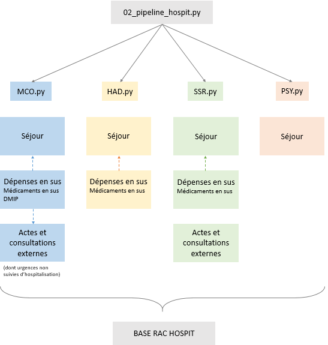

### Schémas détaillés du code
 
Chacune des boîtes figurant sur le schéma de la structure générale du code correspond à une fonction définie dans le script de la spécialité hospitalière correspondante (`mco.py`, `had.py`, `ssr.py` et `rip.py`).  
Pour faciliter la lecture de ces fonctions, les schémas détaillés ci-dessous résument l'ensemble 
des traitements appliqués par PMSI .

#### En MCO
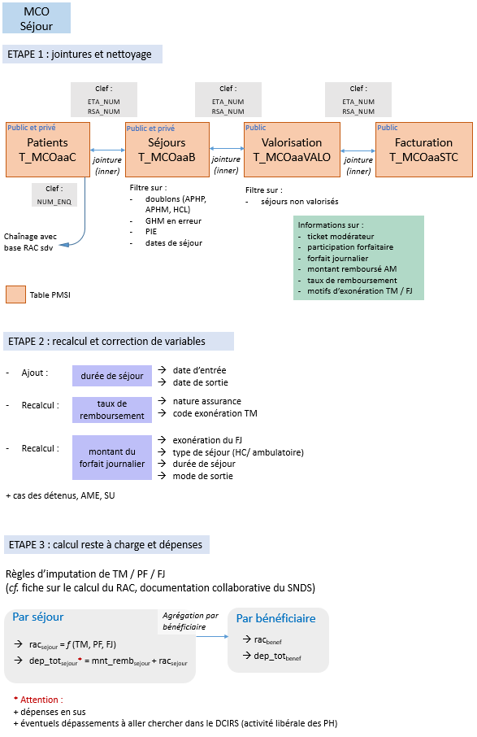   
--------------------------------------------------------------------------------
    
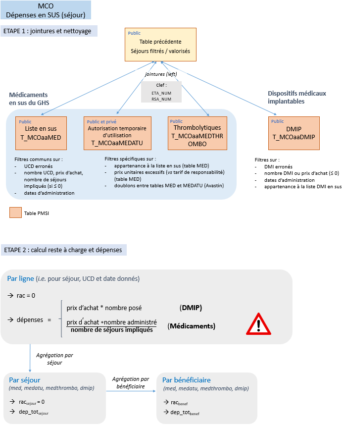  
-------------------------------------------------------------------------------- 
    
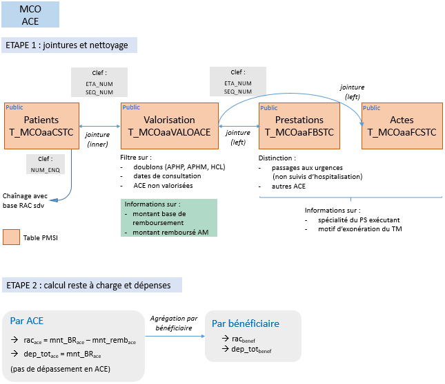  
--------------------------------------------------------------------------------   
    
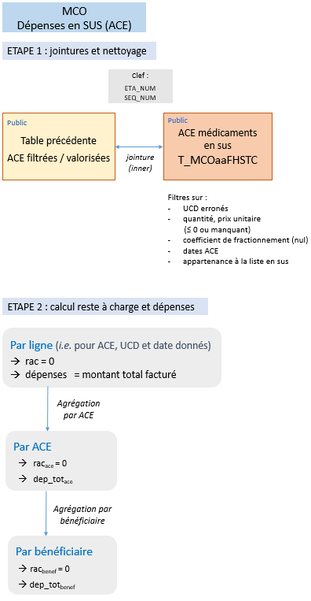  
--------------------------------------------------------------------------------  
    
#### En HAD

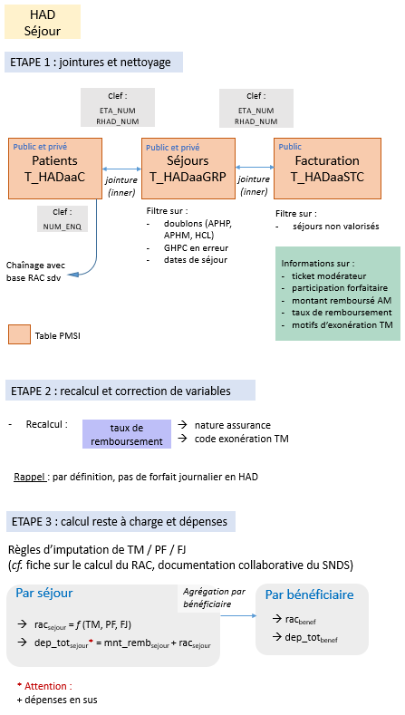  
-------------------------------------------------------------------------------- 
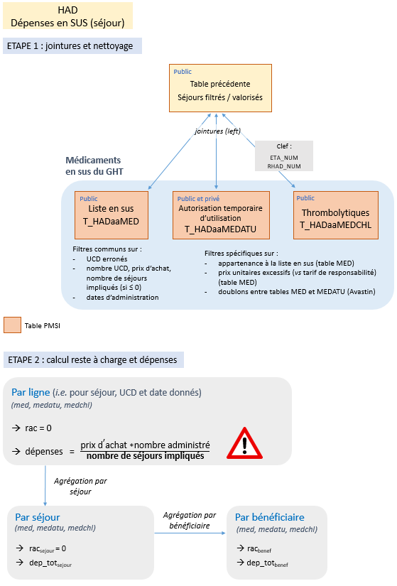 

#### En SSR

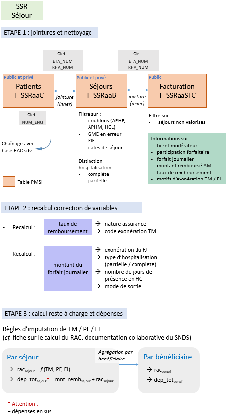  
-------------------------------------------------------------------------------- 
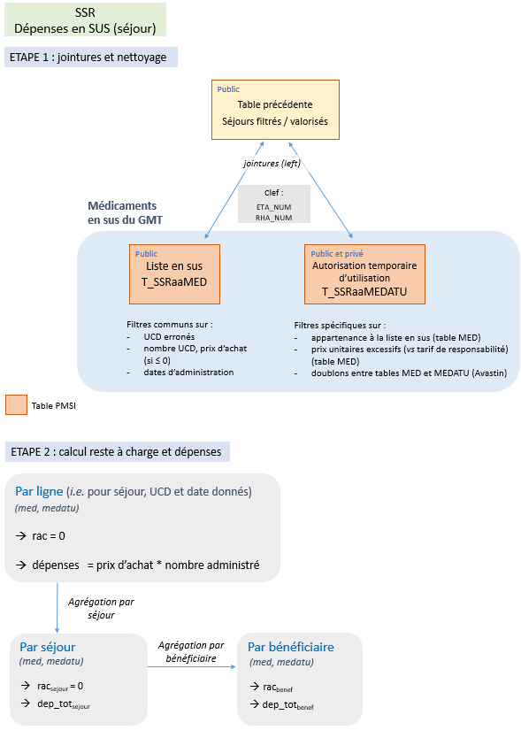
-------------------------------------------------------------------------------- 
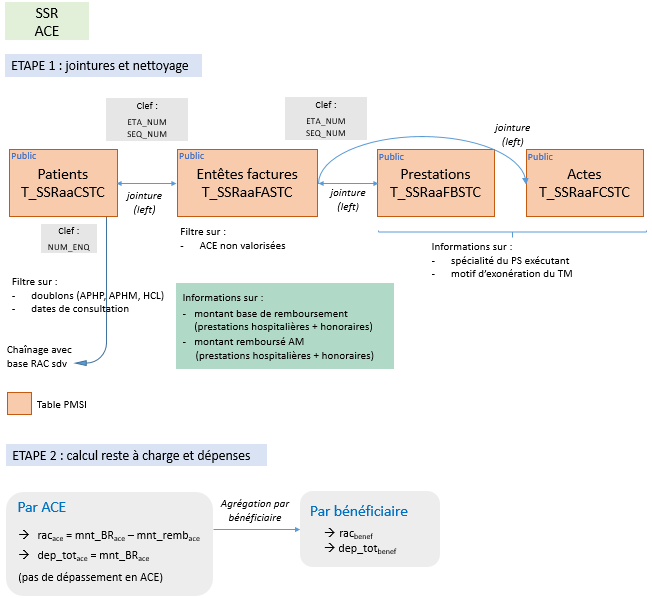

#### En PSY
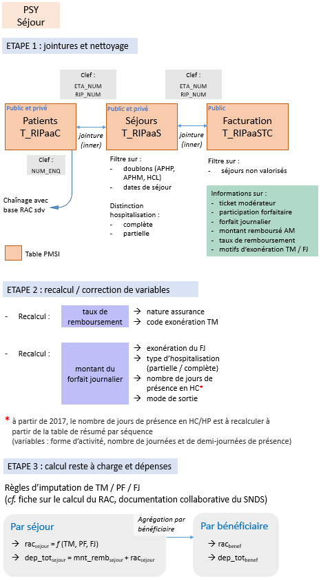 

--------------------------------------------------------------------------------  
 
# Glossaire

- **ACE** : actes et consultations externes  
- **ALD** : affection de longue durée   
- **AME** : aide médicale d'État  
- **AMC** : assurance maladie complémentaire    
- **AMO** : assurance maladie obligatoire    
- **CMU-C** : couverture maladie universelle complémentaire   
- **DCIRS** : datamart de consommation inter-régime simplifié   
- **DMIP** : dispositifs médicaux implantables  
- **ES** : établissement de santé  
- **ESPIC** : établissement de santé privé d'intérêt collectif  
- **FJ** : forfait journalier  
- **GHPC** : groupe homogène de prise en charge  
- **GHS** : groupe homogène de séjour  
- **GME** : groupe médico-économique
- **HAD** : hospitalisation à domicile  
- **HC** : hospitalisation complète  
- **HP** : hospitalisation partielle  
- **MCO** : médecine chirurgie obstétrique  
- **PF** : participation forfaitaire  
- **PH** : praticien hospitalier  
- **PIE** : prestations inter-établissements    
- **PMSI** : programme de médicalisation des systèmes d'information  
- **RAC** : reste à charge
- **RIP** : recueil d'information en psychiatrie    
- **PSY** : psychiatrie  
- **SSR** : soins de suite et réadaptation  
- **SU** : soins urgents  
- **TM** : ticket modérateur  
