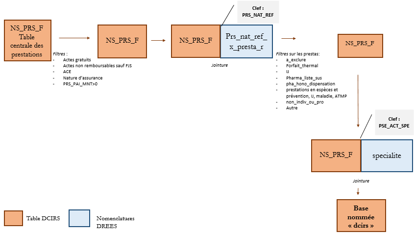
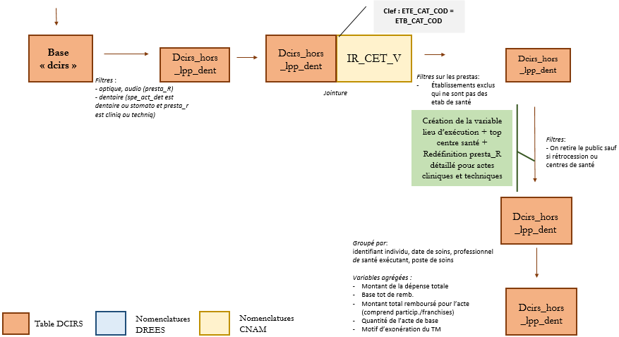
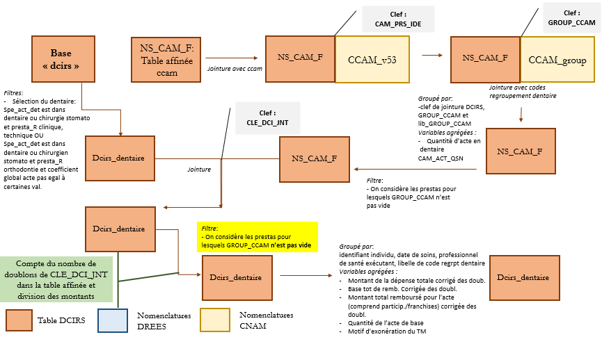
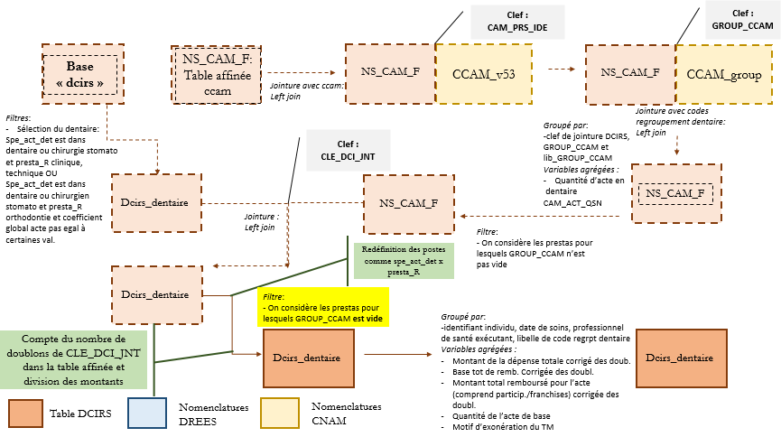
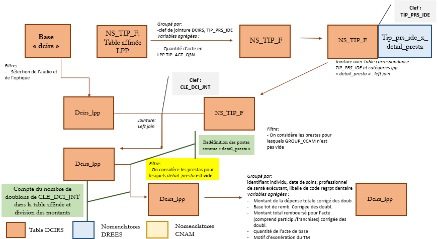

# Base des dépenses et restes à charge pour les soins de ville et établissements de santé privés

Des précisions sur l'extraction des dépenses et RAC à partir du DCIRS sont décrites dans les fiches thématiques suivantes :  
- [Dépenses de soins de ville dans le DCIRS](https://documentation-snds.health-data-hub.fr/fiches/montant_soins_de_ville.html#dcirs)  
- [Dépenses des établissements privés à partir du DCIRS](https://documentation-snds.health-data-hub.fr/fiches/fiche_etab_prives.html) 

## Périmètre de la base

### Champ 

Le champ de la base RAC est détaillé dans la [présentation générale](../documentation/presentation_generale.md) de cette base.

### Prestations exclues du DCIRS (rappel documentation CNAM)

-	Exclusion des prestations avec une date de soins inconnue :  
prestations avec une date de début des soins (`EXE_SOI_DTD`) non renseignée (`NULL`), ou renseignée avec la valeur `"01/01/0001"`	
-	Exclusion des prestations dont la date de début des soins (`EXE_SOI_DTD`) ou de traitement (`FLX_TRT_DTD`) est antérieure à 3 ans (par rapport à l'année d'étude)  
-	Exclusion des prestations dont le qualificatif de la dépense (`DPN_QLF`) est égal à `71` (lignes « pour information » relatives aux transmissions des consultations externes et des séjours des établissements publics qui ne sont pas encore passés en facturation directe)	
-	Exclusion des prestations non individualisables : prestations non individualisables (`IR_NAT_V.PRS_NAT_RGT` égal à 47)	
-	Exclusion des prestations dont le bénéficiaire est fictif :	prestations dont le bénéficiaire est absent de la table de référence des bénéficiaires (`IR_IBA_R`)	
-	Exclusion des prestations pour les régimes spéciaux du Sénat et de l'Assemblée Nationale (fort risque de ré-identifiation) 
	
### Filtres ajoutés par la DREES

- Exclusion des prestations dont le qualificatif de la dépense (`DPN_QLF`) est égal à `20` (actes gratuits)  
- Exclusion des prestations dont le qualificatif de la dépense (`DPN_QLF`) est égal à `30` (actes non remboursables) sauf si
le code de la prestation de référence `PRS_NAT_REF`est égal à 2252 (forfait journalier de sortie) 
- Exclusion des actes et consultations externes (ACE) à l’hôpital public, *i.e.* variable `ETE_IND_TAA` égale à 1, sauf si 
`ETE_IND_TAA` manquant. En effet, depuis septembre 2011, certains établissements publics ont basculé leur activité ACE 
en facturation directe mais il reste encore des établissements pour lesquels les ACE sont sur leur budget global. 
Ainsi, l’information n’est pas exhaustive dans le DCIRS. On trouve cette information de manière exhaustive dans les tables du PMSI. 
- Ne conserver que les lignes pour lesquelles la nature d'assurance correspond aux risques maladie, maternité, AT/MP, décès et invalidité (`RGO_ASU_NAT` égale à 10, 30, 40, 50 ou 80), selon la convention de la statistique mensuelle. Pour information, le risque maladie représente plus de 97 % de l’ensemble, le risque maternité, 1,2 % et le risque AT/MP 1 %. Ainsi, ce filtre exclut très peu d’observations.
- Ne conserver que les dépenses présentées au remboursement positives (`PRS_PAI_MNT` > 0) : ce filtre exclut les montants nuls.
Les montants négatifs ont déjà été retraités dans le DCIRS. 
- Exclusion des lignes de prestations pour lesquelles la variable qui code le fait d'être public ou privé, `PRS_PPU_SEC` de la table
`NS_PRS_F`, prend la valeur 1 (« public »), sauf dans le cas de rétrocessions et d’actes pratiqués en centres de santé (variable catégorie de l'établissement exécutant : `ETE_CAT_COD` égale à 125, 130, 132, 133, 134, 142, 223, 224, 228, 230, 268, 269, 289, 297, 347, 413, 414, 433, 438, 439, 700).

### Prestations exclues 

Le détail des codes prestations exclus est donné par la table de correspondance `prs_nat_ref_x_presta_R.txt` (catégorie « à_exclure »).
Sont exclues notamment : les prestations non individualisables ou versées à un professionnel de santé, les indemnités journalières, les prestations en espèces prévention IJ maladie et ATMP. 

### Les catégories d’établissement : exclusion du médico-social non exhaustif

Ce filtre n'est fait que pour la partie hors liste des produits et prestations (LPP) et hors dentaire.

Une jointure est effectuée avec la table de nomenclature `IR_CTE_V` du répertoire `ORAVAL` afin d’obtenir plus de détail 
sur la catégorie d’établissement ayant réalisé le soin.  
Les deux premiers chiffres de la variable `ETB_CAT_RG1` permettent de constituer le groupement ci-dessous :

- 11	ETABLISSEMENTS HOSPITALIERS
- 12	AUTRES ETABLISSEMENTS RELEVANT DE LA LOI HOSPITALIERE
- 21	CABINETS LIBERAUX (SCANNER ET IRMN)
- 22	AUTRES ETABLISSEMENTS DE SOINS ET DE PREVENTION
- 34	AUTRES ETABLISSEMENTS A CARACTERE SANITAIRE
- 41	ETABLISSEMENTS ET SERVICES POUR L’ENFANCE ET LA JEUNESSE HANDICAPEE
- 43	ETABLISSEMENTS ET SERVICES POUR ADULTES HANDICAPES
- 44	ETABLISSEMENT POUR PERSONNES AGEES
- 45	ETABLISSEMENTS ET SERVICES SOCIAUX CONCOURANT À LA PROTECTION DE L’ENFANCE
- 46	AUTRES ETABLISSEMENTS D’ACCUEIL, HEBERGEMENT ET DE READAPTATION SOCIALE
- 99	VALEUR INCONNUE

Les codes 41, 43, 44, 45 et 46 sont exclus puisqu’il ne s’agit pas d’établissement de santé. 

### Lieu d’exécution des soins 

Lorsqu'aucun numéro d’établissement n’est lié à une prestation (`ETB_EXE_FIN`==0), le soin se trouve dans la catégorie « Ville ». 
Les prestations des établissements avec code regroupement 21 et 22 (cabinets libéraux scanner et irmn et autres établissements de soins
et de prévention) sont également intégrés à la ville sauf si `ETE_CAT_COD` est égal à 698 (autres établissements relevant de la loi hospitalière). 

Enfin, lorsque le code public/privé (`PRS_PPU_SEC` de la table `NS_PRS_F`) prend la valeur 1 les prestations se retrouvent
dans la catégorie « Public ». Les prestations restantes appartiennent à la catégorie « Prive ». 
Dans la catégorie « Public », seules les rétrocessions et les prestations en centre de santé sont conservées. 

Pour ce faire on recode la variable `presta_R` et on code un top centre de santé `csante`.   
Ce top prend la valeur 1 si les deux conditions suivantes sont remplies :
 - `PRS_PPU_SEC` est égal à 1 (établissement public)
 - `ETE_CAT_COD` est égal à l'un des codes suivants : 125, 130, 132, 133, 134, 142, 223, 224, 228, 230, 268, 269, 289, 297, 347, 413, 414, 433, 438, 439, 700  

Nous supprimons ensuite les prestations pour lesquelles `lieu_exec`== "public" (public) sauf s'il s'agit de rétrocession et de centres de santé. 
Cela n'exclut pas l'activité libérale des praticiens hospitaliers dans le public car `PRS_PPU_SEC` correspond à public pour une catégorie d'établissement public et pour un code de professionnel de santé (PS) manquant ou égal à "00000000". 

## Constitution des postes de soins

Les postes de soins sont construits à partir des codes prestations du DCIRS (ainsi que des codes de la liste des produits et prestations
(LPP) et de la classification commune des actes médicaux (CCAM) pour certains postes) et de la spécialité du professionnel exécutant.

### ETAPE 1 

Les postes de soins suivants sont construits à partir de la table de correspondance `prs_nat_ref_x_presta_R` : 
-	Pharma
-	Pharma_15 
-	Pharma_30
-	Pharma_65 
-	Pharma_100
-   Retrocession
-   Retrocession_30
-   Retrocession_65
-   Retrocession_100
-	Supplement_hospit[^1] 
-	Pharma_hospit
-	Pharma_liste_sus
-	Pha_hono_dispensation
-	Transport 
-	Labo 
-	Autre_forfait 
-	Forfait_dialyse 
-	Forfait_technique 
-	LPP_autre
-	Prothèses dentaires et orthodontie (poste détaillé)
-	Optique (poste détaillé)
-	Audioprothèses (poste détaillé)
-	cliniq : consultations et visites 
-	techniq : actes techniques
-	etab_priv

[^1]: Le poste « supplement_hospit » concerne les codes prestations (2114, 2115, 2116, 2117, 2118, 2151, 2152, 2153, 2154, 2195, 2196). Il représente environ 400 millions d’euros en 2016. Il s’agit de suppléments liés à un séjour. Il est ensuite fusionné 
dans le poste *etab_priv*. 

Les postes sont ensuite croisés avec le PS exécutant ou le lieu d'exécution suivant la catégorie du poste (*cf.* étape suivante).

### ETAPE 2 

Les codes spécialité ou nature d'activité du professionnel exécutant (`PSE_ACT_SPE` dans la table `NS_PRS_F`) sont regroupés en grandes catégories de spécialités médicales (*cardio*, *chir*, *omni*, etc.) à l'aide de la [table de correspondance](../data/nomenclatures) `pse_act_spe_x_spe_act_det.txt`.

Les catégories *cliniq* (consultations et visites) et *techniq* (actes techniques) sont ventilées par professionnels de santé :
-	Dentiste (*Dentiste*)
-	Sage-femme (*Sage_femme*)
-	Kinésithérapeute (*Kine*)
-	Pédicure hors LPP (*Pedicure_hors_LPP*)
-	Orthophoniste (*Orthophoniste*)
-	Orthoptiste (*Orthoptiste*)
-	Infirmier (*Infirmier*)
-	Laboratoire (*Labo*)
-	Pharmacie (*Pharma*)
-	Fournisseur (*Fournisseur*)
-	Non médecin (*Non_med*)
-	Médecin généraliste (*Omni*)
-	Anesthésiste réanimateur (*Anesth_Rea*)
-	Cardiologue (*Cardio*)
-	Chirurgien (*Chir*)
-	Chirurgien dentaire stomatologue (*chir_dent_stom*)
-	Dermatologue (*Dermato*)
-	Radiologue (*Radiologue*)
-	Gynécologue (*Gyneco*)
-	Gastro-entérologue (*Gastro*)
-	Interne en médecine (*med_int*)
-	ORL (*ORL*)
-	Pédiatre (*pediatre*)
-	Rhumatologue (*Rhumato*)
-	Ophtalmologue (*Ophtalmo*) 
-	Psychiatre (*Psy*)
-   Transporteur (*Transporteur*)
-	Autre spécialités (*autres_spe*) : *c.f.* annexe 1

En complément, dans le cas où `PSE_ACT_SPE` n'est pas informative (catégorie *Non_med*), il est possible dans certains cas de déduire la spécialité médicale à partir des codes prestations. Ces cas sont recensés dans `nomenclature_liste_presta_non_med.csv`.  

### ETAPE 3

Création d'une variable de lieu d'exécution. Si le lieu d'exécution est privé, les actes cliniques et techniques ainsi que les postes
Labo et LPP_autre sont ventilés en fonction du lieu d'exécution.   
On regroupe ainsi les parties exécutées dans un établissement privé dans le poste agrégé `etab_priv`. 

Par ailleurs, les forfaits techniques, forfaits dialyse et autres forfaits ayant lieu en établissement privé sont regroupés avec le poste `etab_priv`.

### ETAPE 4 

Pour les postes audioprothèses, optique et dentaire, des jointures avec les tables affinées CCAM et LPP sont réalisées afin de
construire des postes plus fins que ne le permettent les codes prestations. 

À nouveau, une table de correspondance est utilisée pour construire les postes de soin. Il s’agit de la table `tip_prs_ide_x_detail_presta.txt`. 

*Note* : Les prestations en dentaire qui n'ont pas de code de regroupement sont les prestations des chirurgiens stomatologues (actes cliniques, techniques et orthodontie).

## Schémas du code 

La [pipeline](../pipeline_baserac) `01_baserac_sdv.py` est le script qui permet de construire la base RAC partie soins de ville et établissements de santé privés.   
Cette pipeline appelle successivement les fonctions définies dans les scripts `sdv.py` et `agg_sdv.py` (contenus dans le fichier [baserac](../baserac)).  
Ces fonctions permettent de traiter le DCIRS comme décrit ci-dessus, afin de reconstituer les postes de soins.   
Les différents indicateurs de dépenses et de remboursement sont ensuite calculés par poste de soins, puis agrégés par consommant, pour ne plus avoir qu'une ligne par poste de soin et par consommant.

Les grandes étapes du code sont résumées dans les schémas suivants :

**Première partie du code : import et jointure avec les nomenclatures « catégories » de prestations et de spécialités d’exécutants**  

  

**Deuxième partie du code : traitement des codes prestations hors LPP et dentaire**  

  

**Troisième partie du code : traitement des codes prestations dentaire 1/2**  

  

**Troisième partie du code : traitement des codes prestations dentaire 2/2**  

  

**Quatrième partie du code : traitement des codes prestations LPP 1/2**  

  

**Quatrième partie du code : traitement des codes prestations LPP 2/2**  

  

## Précisions sur les participations supplémentaires

Afin de prendre en compte les participations supplémentaires, nous considérons les variables `AR1_REM_MNT`, 
`AR2_REM_MNT` et `AR3_REM_MNT`. Tout d'abord, nous corrigeons ces variables à zéro quand `AR1_REM_TYP`, 
`AR2_REM_TYP` et `AR3_REM_TYP` sont respectivement égales à 10 (car cela correspond à des remboursements supplémentaires par les organismes complémentaires pour les individus en ACS, qui ne sont que très partiellement renseignés). 
Puis nous sommons les trois types d'ARO pour obtenir le montant total des parts supplémentaires prises en charge par le public pour une même prestation. 
Cela permet de définir une nouvelle variable de reste à charge, `rac_amo_sup`, qui est le rac après intervention
de l'AMO et des participations supplémentaires. 

##

  
    
---------------------------------------------------------------------------------------------------------

## ANNEXE 1 

### Liste des spécialités de la catégorie « Autres spécialités » dans la base de reste à charge SNDS 2016

Pour information, voici la liste des spécialités dans Autres spécialités, dans la base HCAAM 2016 :
- Pneumologie 
- Réanimation médicale
- Médecine physique et réadaptation
- Neurologie
- Gériatrie
- Néphrologie
- Anatomie-cytologie-pathologie
- Directeur laboratoire médecin
- Endocrinologie et métabolismes
- Hématologie
- Médecine nucléaire
- Oncologie médicale
- Oncologie radiothérapie 
- Radiothérapie
- Génétique médicale
- Santé publique et médecine sociale

---------------------------------------------------------------------------------------------------------

## ANNEXE 2 : Informations relatives à la rétrocession hospitalière et aux médicaments facturés en sus dans le SNDS

Les informations relatives à la rétrocession hospitalière et aux médicaments facturés en sus des prestations d'hospitalisation se trouvent dans la table `ER_UCD_F`, laquelle concerne le codage affiné UCD (Unité Commune de Dispensation). 

Cette table existe depuis le 1er octobre 2008 (date de mise à disposition des données `FLX_DIS_DTD` >= 01/11/2008). 

La table `ER_UCD_F` contient des données concernant : 
- la rétrocession hospitalière, pour laquelle la donnée `UCD_TOP_UCD = 0`, 
- les médicaments en sus du GHS, pour lesquels `UCD_TOP_UCD = 1`. 

Une circulaire de la CNAMTs datée du 17 mars 2009, précise que le codage des médicaments en sus du GHS est obligatoire pour les établissements privés à partir du 1er mars 2009.

### Rétrocession hospitalière 

La rétrocession hospitalière concerne presque exclusivement les établissements publics. 

Plus de 99 % des remboursements de médicaments codés en UCD correspondent aux trois codes de nature de prestations `prs_nat_ref` suivants : 
- 3317 pharmacie hospitalière à 100 %, 
- 3318 pharmacie hospitalière à 65 %, 
- 3319 pharmacie hospitalière à 30 %. 

### Médicaments en sus du GHS 

Les informations concernant les médicaments en sus du GHS concernent presque exclusivement les établissements privés. 

Sur l’ensemble de la période couverte par la table `ER_UCD_F`, plus de 99 % des médicaments en sus du GHS codés en UCD correspondent au code de nature de prestation prs_nat_ref 3320 (pharmacie hospitalière en sus du GHS). 

---------------------------------------------------------------------------------------------------------

