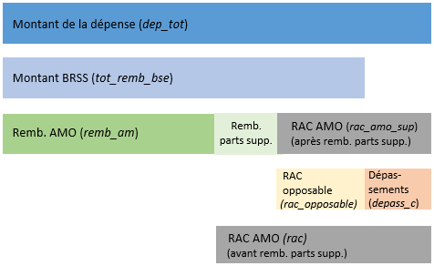

  

#  Documentation générale de la base RAC SNDS

## Présentation de la base RAC

La connaissance de la distribution des dépenses de santé et des restes à charge (RAC) associés, après remboursement par l’Assurance maladie obligatoire (AMO), représente un enjeu important pour le pilotage des politiques de santé. Pour répondre à ce besoin, la DREES a construit la base RAC, une base de données simplifiée des dépenses et des RAC AMO.

### Données 

Les données utilisées proviennent du Système national des données de santé (SNDS).   

Elles sont issues d’une exploitation inédite de l’appariement entre :
- le Datamart de consommation inter-régime simplifié[^1] (DCIRS), géré par la Caisse nationale d’assurance maladie (CNAM), 
- et le Programme de médicalisation des systèmes d’information (PMSI), géré par l’Agence technique de l’information sur l’hospitalisation (ATIH).  

Le **DCIRS** contient des informations sur les soins présentés au remboursement en ville ou en établissements de santé privés[^2], pour l’ensemble des bénéficiaires des différents régimes d’Assurance maladie (hors Sénat et Assemblée nationale).    

Le **PMSI** fournit une description médico-économique des soins hospitaliers en médecine, chirurgie, obstétrique et odontologie (MCO), hospitalisation à domicile (HAD), soins de suite et de réadaptation (SSR) et psychiatrie. 

Pour la constitution de la base RAC, les informations sur les soins à l’hôpital public sont extraites du PMSI ; celles sur les soins en établissements de santé privés sont extraites du DCIRS.  
Le « public » recouvre plus précisément les établissements ex-DG (établissements publics et ESPIC ex-DG), tandis que le « privé » recouvre les établissements privés à but lucratif et non lucratif (hors ESPIC ex-DG).

[^1]: Les codes présentés ici ont servi à l'élaboration des bases RAC version 2016 et 2017. Pour les versions ultérieures, la partie soins de ville et établissements de santé privé sera issue du DCIR (non simplifié).   

[^2]: Et de manière non exhaustive pour les établissements de santé publics.

### Champ de la base

Le champ de la base RAC couvre les **dépenses remboursables et présentées au remboursement**, réalisées l'année du millésime de la base, en ville, à l’hôpital public ou en établissement de santé privé. 

La population de la base RAC :
- est limitée aux assurés ayant consommé au moins une fois des soins sur le territoire français l'année du millésime, appelés les **"consommants"** 
- couvre l'ensemble des "consommants", quel que soit leur régime d'affiliation, excepté les régimes spéciaux de l'Assemblée Nationale et du Sénat, du fait du risque de réidentification.

Dépenses exclues : 
- Les **dépenses non directement individualisables** ne sont pas prises en compte dans l’analyse. Il s’agit notamment de dépenses forfaitaires qui ne peuvent pas être directement affectées à un bénéficiaire spécifique (*e.g.* rémunération des médecins libéraux sur objectifs de santé publique, missions d’intérêt général, aide à la contractualisation  [MIGAC]).  
- Les **dépenses non remboursables** ne sont pas prises en compte car elles ne remontent pas dans le PMSI et ne remontent que partiellement dans le DCIRS. À l'hôpital, il s'agit notamment de suppléments pour confort personnel non couverts par l'AMO (*e.g.* chambre particulière pour convenance personnelle, télévision, téléphone, repas accompagnant, etc.).    
- Les **dépenses incluses dans les forfaits de soins des établissements médico-sociaux** (pour personnes handicapées ou âgées, USLD, etc.) sont exclues de la base car elles ne sont que partiellement renseignées dans le SNDS. 

Les montants des dépenses dans cette base appariée sont comparables à ceux présentés dans les Comptes de la santé sur le champ du « remboursable et présenté au remboursement » et des « dépenses directement individualisables » (Beffy et al., 2017 ; Gonzalez et al., 2018) en ville et pour les soins en établissements privés, mais pas pour les soins hospitaliers publics.    
En effet, les Comptes de la santé suivent les règles de comptabilité nationale harmonisées au niveau européen qui précisent que les services non marchands, tels que les soins hospitaliers publics, sont à valoriser aux coûts des facteurs (masse salariale, achat de médicaments, etc.). Cette valorisation diffère de celle enregistrée dans le SNDS, qui correspond aux recettes des établissements. En conséquence, le montant de la dépense associée aux soins hospitaliers publics issus de la base RAC correspond aux produits des établissements provenant de l’assurance maladie, des ménages, des organismes complémentaires en santé et de l’État, associés à des dépenses remboursables et individualisables dans les établissements publics. La différence entre les charges utilisées pour calculer la CSBM et ces produits spécifiques provient, entre autres, du déficit et des produits non individualisables des établissements.

### Contenu de la base

La base RAC comprend une ligne par consommant et par poste de soins, pour l’année sur laquelle elle est indexée.   
La ventilation des dépenses par poste de soins résulte du regroupement des prestations en grandes catégories de soins, en fonction de la nature de chaque prestation, de la nature du professionnel exécutant et du lieu d'exécution.   
Les postes de soins les plus fins sont listés dans le document [nomenclatures_base_rac.csv](../data/nomenclatures/nomenclatures_base_rac.csv). Ce document donne également la correspondance entre ces postes fins (colonne `poste`) et des niveaux d'agrégation supérieurs, utilisés dans le cadre des analyses issues de la base RAC et intitulés : poste semi-agrégé (colonne `poste_semi_ag`), poste agrégé (`poste_ag`), poste racine (`poste_racine`), poste CNS (`poste_cns`) (correspondance avec les comptes de la santé), et séparation ville/hôpital (`separation_sdv_hospit`).     

La base RAC contient :   
- des informations sur les **caractéristiques individuelles des consommants** (âge, sexe, lieu de résidence, statut ALD, statut CMU-C et statut ACS) (*c.f.* [fiche correspondante](../documentation/caracteristiques_individuelles.md)); 
- ainsi que des **indicateurs de dépense et de remboursement** (montant de la dépense, base de remboursement, dépense remboursée par l’AMO, RAC AMO avec distinction de la partie opposable et de la liberté tarifaire ; et avec distinction, pour les patients en ALD, des dépenses/remboursements/RAC avec ou sans lien avec leur affection).

### Précisions sur les indicateurs de dépense et de remboursement 

L'ensemble des dépenses associées à une prestation ou à un séjour en établissement comprend :
* le **montant remboursé** par le public :  
  * la **part légale**, prise en charge par l'assurance maladie obligatoire (AMO),    
  * les **parts supplémentaires**, prises en charge par les pouvoirs publics (CMU-C, AME, soins urgents, détenus, etc.)  
* le **reste à charge après AMO** (payé par le patient et / ou son organisme complémentaire), lui même composé :
  * du **RAC opposable**, qui est la différence entre le tarif de convention (Montant BRSS) et le remboursement de la Sécurité sociale
  * d'éventuels **dépassements** d'honoraires

Le schéma ci-dessous illustre l'articulation entre les différents indicateurs de dépense et de remboursement, tels que définis dans la base RAC : 
     
  
**AMO** : assurance maladie obligatoire ; **BRSS** : base de remboursement de la sécurité sociale ; **RAC** : reste-à-charge ;  
**remb.** : remboursement ; **parts supp.** : parts supplémentaires prises en charge par les puvoirs publics (CMU-C, AME, soins urgents, détenus, etc.)

*Précisions sur le calcul des différents indicateurs dans le cas général*

- `Reste à charge AMO (part légale)` = Montant de la dépense (base de remboursement + dépassement) – Montant remboursé par l’AMO (hors parts supplémentaires)  
- `Reste à charge AMO (part légale + suppléments)` = Montant de la dépense (base de remboursement + dépassement) – Montant remboursé par l’AMO (hors parts supplémentaires) - Parts supplémentaires remboursées 

Attention, si les parts supplémentaires couvrent généralement tout ou partie du RAC opposable, il est possible que ces suppléments aillent
au-delà de la BRSS et prennent en charge une partie des dépassements. 
C'est notamment le cas pour les bénéficiaires de la CMU-C qui peuvent, dans la limite de tarifs fixés 
par arrêtés, bénéficier de la prise en charge de frais dépassant les montants remboursables par
l'Assurance Maladie pour les prothèses dentaires, l'orthopédie dento-faciale, les lunettes, 
les prothèses auditives, et d'autres produits et appareils médicaux ([Ameli](https://www.ameli.fr/chirurgien-dentiste/exercice-liberal/prescription-prise-charge/situation-patient-cmu-c/situation-patient-cmu-complementaire)).  
Nous noterons **parts supp. dépassement** la partie des dépassements couverte par les parts supplémentaires.   

Ainsi, pour le calcul du RAC opposable et du dépassement, il faut distinguer deux cas de figure :
- **CAS 1** : Base de remboursement >= Montant remboursé par l’AMO (part légale et parts supplémentaires)  
  `Reste à charge opposable AMO` = Base de remboursement – Montant remboursé par l’AMO (hors parts supplémentaires) - Parts supplémentaires remboursées   
  `Parts supp. dépassement` = 0   
  `Dépassement` = Montant de la dépense – Base de remboursement = RAC AMO - RAC opposable  
- **CAS 2** : Base de remboursement < Montant remboursé par l’AMO (part légale et parts supplémentaires)  
  `Reste à charge opposable AMO` = 0  
  `Parts supp. dépassement` = Parts supplémentaires remboursées - Base de remboursement - Montant remboursé par l’AMO (hors parts supplémentaires))   
  `Dépassement` =  Montant de la dépense – Base de remboursement - Parts supp. dépassements    
  `Dépassement` =  Montant de la dépense – Montant remboursé par l’AMO (hors parts supplémentaires) - Parts supplémentaires remboursées   
  `Dépassement` =  RAC AMO - RAC opposable

*Spécificité pour le calcul du reste-à-charge après AMO à l'hôpital public*  

Le RAC hospitalier correspond généralement au ticket modérateur (ou participation forfaitaire) et au forfait hospitalier, avec :   
* différents cas de figure d'exonération en fonction du type d’actes/de séjours, du profil des patients  
* différentes modalités de facturation et de calcul du RAC par discipline hospitalière (MCO/SSR/HAD/PSY)  

À cela s’ajoutent d'éventuels dépassements d’honoraires.  
Une description détaillée de la méthode de calcul est donnée dans la fiche thématique sur le 
[reste à charge après AMO en établissements de santé publics](https://gitlab.com/healthdatahub/documentation-snds/blob/66-le-reste-a-charge-apres-amo-en-etablissements-publics/fiches/rac_hopital_public.md).

### Cas particulier des montants en lien avec une Affection de longue durée (ALD)

Pour les bénéficiaires en ALD, seulement les prestations en lien avec leur affection sont prises en charge au titre de l'ALD.  

Une dépense est ainsi considérée en lien avec une ALD lorsque le  motif d’exonération dépend de l’une des affections du patient s’il en a plusieurs ou de son affection s’il n’en a qu’une, pour la prestation considérée.    

Il est possible d'identifier les prestations en lien avec une ALD :
- dans le PMSI, si la variable `EXO_TM` (justification d'exonération du ticket modérateur) prend la valeur 4 dans la table de facturation des séjours (`XXX_STC`, avec XXX la discipline hospitalière), ou dans les tables de facturation des actes et consultations externes (ACE) (`XXX_FBSTC` ou `XXX_FCSTC`) ;
- dans le DCIRS, si la variable `EXO_MTF` (motif d'exonération du ticket modérateur) prend les valeurs 42, 44 ou 46 dans la table centrale des prestations (`NS_PRS_F`)   

Attention, en cas de cumul de plusieurs ALD, le motif d'exonération du ticket modérateur ne permet pas de savoir au titre de quelle affection a eu lieu la dépense.

Les variables `dep_lien_ald`, `mnt_rem_lien_ald` et `aro_rem_lien_ald` indiquent respectivement les dépenses, montants remboursés par l'AMO et parts supplémentaires en lien avec la (ou les) ALD.  
La variable `rac_lien_ald` qui correspond au reste à charge en lien avec l'ALD, après remboursement de la part légale et des parts supplémentaires, est calculée comme suit : `rac_lien_ald` = `dep_lien_ald` - `mnt_rem_lien_ald` - `aro_rem_lien_ald`

## Construction de la base RAC : description du projet git 

### Les codes (pyspark) de construction de la base

La construction de la base RAC est structurée en trois parties : `(01)` construction de la base RAC soins de ville et établissements de santé privés à partir du DCIRS, `(02)` construction de la base RAC établissements de santé publics à partir du PMSI, et `(03)` chaînage de la base RAC partie soins de ville et établissements de santé privés, et partie établissements de santé publics.

Chacune de ces parties est exécutée dans un script dédié, appelé "pipeline", contenu dans le dossier [pipeline_baserac](../pipeline_baserac).  
Ces pipelines appellent successivement les fonctions définies dans les scripts contenus dans le dossier [baserac](../baserac). 

En complément, une quatrième pipeline `(04)` permet de sortir des indicateurs agrégés à partir de la base RAC, dont certains sont restitués dans les [Études et résultats](#publications-de-r%C3%A9f%C3%A9rence) issus de la base RAC.   

Les grandes étapes de construction et d'exploitation de la base RAC sont donc réalisées dans les pipelines suivantes (à appeler successivement) :  
- `01`. [Soins de ville](../pipeline_baserac/01_pipeline_sdv.py) : construction de la base RAC soins de ville et établissements de santé privés   
  Traitement des données du DCIRS (table centrale des prestations et tables affinées LPP et CCAM), application de filtres, agrégation des prestations par poste de soins, et calcul des indicateurs de dépenses et de remboursements. 
- `02`. [Hôpital](../pipeline_baserac/02_pipeline_hospit.py) : construction de la base RAC établissements de santé publics à partir du PMSI  
  Traitement successif des données des différentes disciplines hospitalières : HAD, MCO (*y.c.* actes et consultations externes), PSY et SSR (*y.c.* actes et consultations externes), application de filtres, et calcul des indicateurs de dépenses et de remboursements.
- `03`. [Chaînage](../pipeline_baserac/03_pipeline_chaining.py) (des bases RAC soins de villes, ES privés et hôpital public) et enregistrement de la base RAC   
  Jointure des bases RAC générées au cours des deux étapes précédentes, harmonisation des colonnes, et ajouts d'indicateurs sur les caractéristiques individuelles des consommants. 
- `04`. [Statistiques descriptives](../pipeline_baserac/04_pipeline_indicators.py)  
  Distribution des effectifs (par âge, poste de soin, statut ALD, CMU-C, etc.), distribution des dépenses et des remboursements, analyse de leur composition (par poste de soins, en ville ou à l'hôpital, avec ou sans lien avec une ALD, etc.), découpage de la population par niveau de consommation (répartition par déciles et centiles de dépenses et de RAC).  

### Informations pratiques sur la construction de la base RAC

Les différentes étapes de la construction de la base RAC (nettoyage des bases, utilisation de filtres, estimation des dépenses et du RAC) sont décrites en détail dans les fichiers suivants :   
- [caracteristiques_individuelles.md](../documentation/caracteristiques_individuelles.md) : extraction des informations socio-démographiques et géographiques par bénéficiaire
- [base_RAC_soins_de_ville_et_es_priv.md](../documentation/base_RAC_soins_de_ville_et_es_priv.md) : extraction des indicateurs de dépenses et de remboursements pour les soins de ville et les établissements privés de santé 
- [base_RAC_hopital_public.md](../documentation/base_RAC_hopital_public.md) : extraction des indicateurs de dépenses et de remboursements pour les établissements publics de santé 

### Test du code sur données simulées 

Le projet git prévoit la possibilité de tester les codes sur des jeux de données simulées.

Données simulées en input :  
Le dossier [raw](../data/raw) dans [data](../data) contient les schémas issus du SNDS (Health Data Hub, CNAM)
ainsi que des données entièrement simulées générées à partir de ces schémas par `tsfaker`.   
Ces données respectent donc la structure des données du SNDS mais ne sont en aucun cas d'authentiques données de santé.  

Codes tests :  
Les scripts contenus dans le dossier [test](../test) correspondent aux scripts du dossier [baserac](../baserac) contenant les principales fonctions utilisées pour la construction et l'analyse de la base RAC, adaptés pour fonctionner sur les données simulées.   

Données simulées en output :  
Le dossier [output](../data/output) dans [data](../data) contient des tables générées en sortie après le test des différentes pipelines de code avec les données simulées comme input.   
Ces données respectent donc la structure des sorties de la base RAC, mais ne permettent en aucun cas de produire des statistiques valables.

Le projet permet d’afficher deux badges : un badge vert « passed » qui indique que le code tourne bien, et un badge de couverture de code qui indique le pourcentage du code qui a été testé.  

### Adaptations à prévoir en fonction de l'année d'étude

Le programme permet de choisir en paramètre l'année et de faire tourner sur l'année de son choix (en fonction des données disponibles ; 2016 et 2017 pour les [études de la DREES](#publications-de-r%C3%A9f%C3%A9rence) issues de ce projet git).

La production de la base pour des années ultérieures repose sur la mise à jour des tables de correspondance.  
Ces tables s’appuient sur des connaissances métiers (fondées en grande partie sur la Statistique mensuelle de la CNAM) et des choix de classification.

Plusieurs [tables de correspondance](../data/nomenclatures) sont utilisées dans la constitution de la base RAC :
-	Correspondance entre codes prestations et postes de soin (`prs_nat_ref_x_presta_R.txt`) :
contient les correspondances entre la variable `PRS_NAT_REF` (nature de la prestation de référence)
issue de la table `NS_PRS_F` (table centrale des prestations du DCIRS) et les postes de soins (variable `presta_R`).   
La nomenclature de `PRS_NAT_REF`se trouve dans la table `IR_NAT_V`. 
La table de nomenclature `prs_nat_ref_x_presta_R` a été établie et complétée méthodiquement à l'aide de la statistique mensuelle de la CNAM (*c.f.* portail CNAM, non mise à jour depuis 2017). 
-	Correspondance entre spécialité ou nature du professionnel exécutant et grande catégorie de spécialité médicale (`pse_act_spe_x_spe_act_det.txt` dans le cas général, et `nomenclature_liste_presta_non_med.csv`, dans le cas où la spécialité médicale est manquante mais peut-être déduite de la `PRS_NAT_REF`)  
-	Correspondance entre codes de la table affinée LPP et les postes de soin (`tip_prs_ide_x_detail_presta.txt`)

Nous utilisons également les codes regroupement de la base [CCAM version 53](../data/nomenclatures/CCAM_V53.csv), dont la documentation se trouve sur le site ameli.fr.   

**Il faudra mettre à jour ces nomenclatures si les codes de construction de la base RAC sont utilisés sur des données plus récentes que 2017.** 

## Utilisation de la base RAC 

### Structure de la base 

La base contient une ligne par **individu consommant x poste de soins**.  
Les variables indicatrices des caractéristiques individuelles sont uniques pour un même bénéficiaire sur une année donnée.   
Elles sont répétées autant de fois qu'il y a de postes de consommation de soins pour un même bénéficiaire.  
Les variables indicatrices de la dépense et du remboursement sont propres à chaque poste de soin et à chaque bénéficiaire.  

### Dictionnaire des variables 

| Variable |  Libellé  |
|----------|-----------|
|`NUM_ENQ` |  identifiant unique du bénéficiaire (`BEN_IDT_ANO` crypté) |
|`BEN_SEX_COD`| code sexe du bénéficiaire (1 : masculin, 2 : féminin) |
|`BEN_RES_DPT`| département de résidence du bénéficiaire |
|`BEN_RES_COM`| commune de résidence du bénéficiaire|
|`code_res_dpt`| département de résidence du bénéficiaire après corrections |
|`code_com_insee` | code commune (INSEE) de résidence du bénéficiaire (concaténation des deux derniers caractères du département et du code commune, sauf cas particulier DOM, Corse ; et après corrections)|
|`BEN_NAI_ANN`| année de naissance du bénéficiaire |
|`age`| âge du bénéficiaire |
|`classe_age`| catégorie d'âge du bénéficiaire par tranche d'âge de 5 ans |
|`classe_age_10`| catégorie d'âge du bénéficiaire par tranche d'âge de 10 ans |
|`top_cmu`| =1 si bénéficiaire de la CMU-C, 0 sinon (construit à partir de `BEN_CTA_TYP` dans `IR_ORC_R` et `NS_PRS_F`)|
|`top_acs`| =1 si bénéficiaire de l'ACS, 0 sinon (construit à partir de `BEN_CTA_TYP` dans `IR_ORC_R` et `NS_PRS_F`) |
|`top_ald`| =1 si bénéficiaire en ALD, 0 sinon (top issu de `IR_IMB_R` croisé avec `EXO_MTF` dans `NS_PRS_F` pour identfier les ALD "actives") |
|`nb_ald`| nombre d'ALD par bénéficiaire |
|`NUM_ALD`| numéro(s) ALD correspondant(es) (liste) |
|`cardio_neurovasc`| binaire, droits ouverts et actifs pour les ALD n°1, 3, 5, 12 et/ou 13 (maladies cardio-neurovacsulaires) |
|`diabete`| binaire, droits ouverts et actifs pour l'ALD n°8 (diabète) |
|`tumeurs`| binaire, droits ouverts et actifs pour l'ALD n°30 (tumeurs malignes) |
|`affection_psy`| binaire, droits ouverts et actifs pour l'ALD n°23 (affections psychiatriques de longues durées) |
|`groupe_ALD`| appartenance (exclusive) à un groupe majoritaire d'ALD (valeurs : *cardio_neurovasc*, *diabete*, *tumeurs*, *affection_psy*, *polypath_top4*, *autres_ald*, *non_ald*) |
|`type_ALD`| appartenance à un type d'ALD (valeurs : *poly_ald*, *mono_ald*, *non_ald*)|
|`poste`| poste de dépense détaillé |
|`poste_semi_ag`| poste de dépense semi-agrégé ([nomenclature base RAC](../data/nomenclatures/nomenclatures_base_rac.csv)) |
|`poste_ag`| poste de dépense agrégé ([nomenclature base RAC](../data/nomenclatures/nomenclatures_base_rac.csv)) |
|`poste_racine`| poste de dépense racine ([nomenclature base RAC](../data/nomenclatures/nomenclatures_base_rac.csv)) |
|`separation_sdv_hospit`| appartenance du poste aux soins de ville ou à l'hôpital (valeurs : *sdv*, *hospit*) |
|`poste_cns`| poste de dépense agrégé ([nomenclature CNS](../data/nomenclatures/nomenclatures_base_rac.csv))|
|`dep_tot`| dépense totale présentée au remboursement | 
|`remb_am`| montant remboursé par l'assurance maladie obligatoire (part légale) |
|`tot_rem_bse`| montant de la base de remboursement de la sécurité sociale|
|`acte_quantite`| quantité d'acte | 
|`rac_opposable`| reste à charge opposable |
|`rac`| reste à charge après AMO (part légale) |
|`rac_amo_sup`| reste à charge après AMO (dep_tot - remb_am (part légale) - remboursements supplémentaires) | 
|`depass_c`| montant des dépassements (dont a été exclu d'éventuels remboursements supplémentaires) |
|`dep_lien_ald`| dépense totale présentée au remboursement, en lien avec une ALD | 
|`mnt_rem_lien_ald`| montant remboursé par l'assurance maladie obligatoire (part légale), en lien avec une ALD |
|`aro_rem_lien_ald`| montant remboursé par le public (parts supplémentaires), en lien avec une ALD |
|`rac_lien_ald`| reste à charge après déduction de la part AMO et des parts supplémentaires, en lien avec une ALD |
|`nb_sejour`| nombre total de séjours du bénéficiaire dans l'année (par discipline hospitalière, hôpital public) |
|`NBSEJ_CPLT_COURT`| nombre de séjours de moins de 30 jours en hospitalisation à temps complet (par discipline hospitalière, hôpital public) |
|`NBSEJ_CPLT_LONG`| nombre de séjours de 30 jours ou plus en hospitalisation à temps complet (par discipline hospitalière, hôpital public)  |
|`NBSEJ_PARTL_COURT`|nombre de séjours de moins de 30 jours en hospitalisation à temps partiel (par discipline hospitalière, hôpital public)|
|`NBSEJ_PARTL_LONG`|nombre de séjours de 30 jours ou plus en hospitalisation à temps partiel (par discipline hospitalière, hôpital public) |
|`NBJ_CPLT`|nombre de jours cumulés d'hospitalisation à temps complet (par discipline hospitalière, hôpital public)|
|`NBJ_PARTL`|nombre de jours cumulés d'hospitalisation à temps partiel (par discipline hospitalière, hôpital public)|
|`MNT_TM`|montant facturé au patient au titre du ticket modérateur (RAC hôpital public)|
|`MNT_PF`|montant facturé au patient au titre de la participation forfaitaire (RAC hôpital public)|
|`MNT_FJ`|montant facturé au patient au titre du forfait hospitalier journalier (RAC hôpital public)|

## Publications de référence

-	**Adjerad, R., Courtejoie, N.** (2020, novembre). 
[Pour 1 % des patients, le reste à charge obligatoire après assurance maladie obligatoire dépasse 3 700 euros annuels. 
DREES, Études et Résultats, 1171.](https://drees.solidarites-sante.gouv.fr/sites/default/files/2021-02/ER_1171_BAT%20BIS.pdf) 

-	**Adjerad, R., Courtejoie, N.** (2021, janvier). 
[Des restes à charge après assurance maladie obligatoire comparables entre patients âgés avec et sans affection de 
longue durée, malgré des dépenses de santé 3 fois supérieures. 
DREES, Études et Résultats, 1180.](https://drees.solidarites-sante.gouv.fr/sites/default/files/2021-02/er_1180.pdf) 

-	**Adjerad, R., Courtejoie, N.** (2021, mai). 
[Hospitalisation : des restes à charge après assurance maladie obligatoire plus élevés en soins de suite et de 
réadaptation et en psychiatrie. 
DREES, Études et Résultats, 1192.](https://drees.solidarites-sante.gouv.fr/sites/default/files/2021-05/ER1192.pdf) 

## Références 

- Beffy , M., et al. (2017, septembre). Les dépenses de santé en 2016. Paris, France : DREES, coll. Panoramas de la DREES-Santé.  
- Gonzalez , L., Roussel, R., Héam, J.-C., et al. (2018). Les dépenses de santé en 2017. Paris, France : DREES, coll. Panoramas de la DREES-Santé

## Glossaire

- **ACE** : actes et consultations externes  
- **ALD** : affection de longue durée    
- **AME** : aide médicale d'État  
- **AMC** : assurance maladie complémentaire    
- **AMO** : assurance maladie obligatoire    
- **ATIH** : agence technique de l’information sur l’hospitalisation   
- **CCAM** : classification commune des actes médicaux   
- **CMU-C** : couverture maladie universelle complémentaire   
- **CNAM** : caisse nationale d’assurance maladie   
- **CNS** : comptes nationaux de la santé  
- **DCIRS** : datamart de consommation inter-régime simplifié  
- **ES** : établissement de santé   
- **ESPIC** : établissement de santé privé d'intérêt collectif  
- **FJ** : forfait journalier  
- **HAD** : hospitalisation à domicile  
- **LPP** : liste des produits et prestations  
- **MCO** : médecine chirurgie obstétrique  
- **PF** : participation forfaitaire   
- **PMSI** : programme de médicalisation des systèmes d'information  
- **RAC** : reste à charge  
- **RIP** : recueil d'information en psychiatrie    
- **PSY** : psychiatrie  
- **SNDS** : système national des données de santé   
- **SSR** : soins de suite et réadaptation  
- **SU** : soins urgents  
- **TM** : ticket modérateur  

---------------------------------------------------------------------------------------------------------
